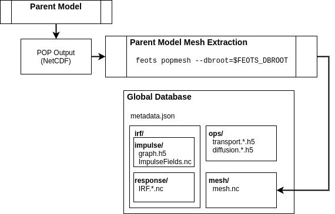
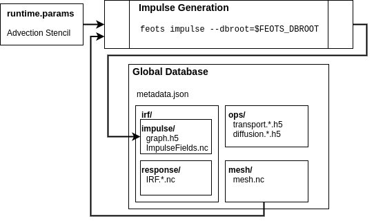

########
Workflow
########

==========================
Overview
==========================
This section of the documentation discusses the steps required to run offline tracer simulations. In short, the following tasks must be accomplished :

* Create impulse fields and passive tracer initial conditions for the parent model
* Run the parent model to produce impulse response functions
* Diagnose transport operators from the impulse and impulse response functions
* Use the transport operators to run offline tracer simulations

For offline tracer simulations, FEOTS has the capability to run in either a global or regional configuration. In the regional configuration, FEOTS provides tools to extract regional transport operators from global operators.

Below, we provide the details for all of the steps in this process while describing how FEOTS global, regional, and simulation databases are created.

==========================
Create Transport Operators
==========================
When we discuss "transport operator diagnosis", we specifically mean that we are diagnosing the rows and columns of a sparse matrix that is equivalent to the application of a discrete advection-diffusion operator as implemented in an ocean general circulation model (the parent model). In every time-step of the parent model, we pass a set of impulse fields through passive-tracer forward stepping. The difference in the forward-stepped field and the impulse field, divided by the parent model time step size, provides us with the columns of the transport operator matrix. 

We have provided tools in FEOTS to aid in the process of impulse field generation and operator diagnosis based on these ideas. This allows you to create your own transport operator databases from an online POP model simulation.

Create a Global Database
************************
If you are planning to use FEOTS to create a transport operator database, your first step is to create the global operator database scaffolding. The global operator database scaffolding refers to the directory structure that is used for storing impulse fields, the transport operator connectivity graph, the parent model global mesh, impulse response functions, transport operators, and a metadata file that describes the database.

To create a global database, you can use the provided :code:`mkdb.sh` script.

.. code-block:: shell

  git clone https://github.com/fluidnumerics/feots.git
  cd feots/scripts
  export FEOTS_DBROOT=/path/to/db/root
  bash ./mkdb.sh $FEOTS_DBROOT

After creating the database, we recommend that you open :code:`/path/to/db/root/metadata.json` and fill out as much of the details as you can about your operator database at this stage.

Mesh Extraction from a Parent Model
***********************************

Almost all of the utilities in FEOTS require a NetCDF file that contains the POP Mesh information. While you can simply store the standard POP output in the global database, the standard NetCDF output contains more information than needed to support impulse field generation, operator diagnosis, and output remapping for offline simulations.

To create impulse functions and corresponding tracer fields to insert into POP for IRF diagnosis, you first need to run the parent model to create at least one output file. Then, you can use the :code:`feots popmesh` to extract the necessary POP mesh information from standard POP NetCDF output.

.. code-block:: shell

  feots popmesh --pop-file /path/to/pop/output.nc --dbroot $FEOTS_DBROOT

Running this FEOTS command will read :code:`/path/to/pop/output.nc`, extract the necessary mesh information, and save the POP mesh file under :code:`$FEOTS_DBROOT/mesh/mesh.nc`.

Impulse Field Generation
************************

An impulse field is a discrete field of 1's and 0's used to diagnose the sparse matrices that capture the advection-diffusion operators in the parent model. Non-zero impulse value placement depends on the domain-of-influence of the discrete advection-diffusion operators and the shape of the discrete ocean boundaries. Together, the mesh information, the parent model advection scheme, and the desire to not have impulse response fields from each grid cell overlap results in a graph coloring problem that FEOTS solves using the Greedy Algorithm.

The advection scheme is specified in the FEOTS namelist file (runtime.params). In future versions of FEOTS, the advection scheme will be read from the :code:`$FEOTS_DBROOT/metadata.json` file.

Currently, operator diagnosis is only supported for the 27-point Lax-Wendroff advection scheme on a global tripole grid.

.. code-block:: shell

  feots impulse --dbroot $FEOTS_DBROOT --param-file /path/to/runtime.params

When you run this FEOTS command, the :code:`$FEOTS_DBROOT/mesh/mesh.nc` file is used in conjunction with the advection scheme stencil to create a connectivity graph (:code:`$FEOTS_DBROOT/irf/impulse/graph.h5`) and a NetCDF file that contains the impulse fields (:code:`$FEOTS_DBROOT/irf/impulse/ImpulseFields.nc`). The impulse fields output is used during the parent model execution to obtain time averaged transport operators.

Parent Model Execution
***********************

Operator Diagnosis
******************

Run Offline Simulations
=======================

Regional Simulations
====================

Mask Generation
***************
The first step in running a regional simulation is to create a mask file that 

Regional Extraction
*******************

Regional Mapping
****************

Initial Conditions
******************

Forward Integration
*******************

Equilibration
*************

Global Simulations
====================

Initial Conditions
******************

Forward Integration
*******************

Equilibration
*************
