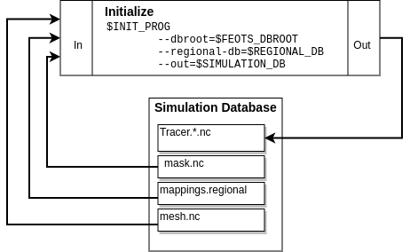

########
Workflow
########

==========================
Overview
==========================
This section of the documentation discusses the steps required to run offline tracer simulations. In short, the following tasks must be accomplished :

* Create impulse fields and passive tracer initial conditions for the parent model
* Run the parent model to produce impulse response functions
* Diagnose transport operators from the impulse and impulse response functions
* Use the transport operators to run offline tracer simulations

For offline tracer simulations, FEOTS has the capability to run in either a global or regional configuration. In the regional configuration, FEOTS provides tools to extract regional transport operators from global operators.

Below, we provide the details for all of the steps in this process while describing how FEOTS global, regional, and simulation databases are created.

==========================
Create Transport Operators
==========================
When we discuss "transport operator diagnosis", we specifically mean that we are diagnosing the rows and columns of a sparse matrix that is equivalent to the application of a discrete advection-diffusion operator as implemented in an ocean general circulation model (the parent model). In every time-step of the parent model, we pass a set of impulse fields through passive-tracer forward stepping. The difference in the forward-stepped field and the impulse field, divided by the parent model time step size, provides us with the columns of the transport operator matrix. 

We have provided tools in FEOTS to aid in the process of impulse field generation and operator diagnosis based on these ideas. This allows you to create your own transport operator databases from an online POP model simulation.

Create a Global Database
************************
If you are planning to use FEOTS to create a transport operator database, your first step is to create the global operator database scaffolding. The global operator database scaffolding refers to the directory structure that is used for storing impulse fields, the transport operator connectivity graph, the parent model global mesh, impulse response functions, transport operators, and a metadata file that describes the database.

To create a global database, you can use the provided :code:`mkdb.sh` script.

.. code-block:: shell

  git clone https://github.com/fluidnumerics/feots.git
  cd feots/scripts
  export FEOTS_DBROOT=/path/to/db/root
  bash ./mkdb.sh $FEOTS_DBROOT

After creating the database, we recommend that you open :code:`/path/to/db/root/metadata.json` and fill out as much of the details as you can about your operator database at this stage.

Mesh Extraction from a Parent Model
***********************************

Almost all of the utilities in FEOTS require a NetCDF file that contains the POP Mesh information. While you can simply store the standard POP output in the global database, the standard NetCDF output contains more information than needed to support impulse field generation, operator diagnosis, and output remapping for offline simulations.

To create impulse functions and corresponding tracer fields to insert into POP for IRF diagnosis, you first need to run the parent model to create at least one output file. Then, you can use the :code:`feots popmesh` to extract the necessary POP mesh information from standard POP NetCDF output.

.. code-block:: shell

  feots popmesh --pop-file /path/to/pop/output.nc --dbroot $FEOTS_DBROOT

Running this FEOTS command will read :code:`/path/to/pop/output.nc`, extract the necessary mesh information, and save the POP mesh file under :code:`$FEOTS_DBROOT/mesh/mesh.nc`.

Impulse Field Generation
************************
.. image:: images/feots_impulse.png
   :width: 50%
   :alt: FEOTS Impulse field generation

An impulse field is a discrete field of 1's and 0's used to diagnose the sparse matrices that capture the advection-diffusion operators in the parent model. Non-zero impulse value placement depends on the domain-of-influence of the discrete advection-diffusion operators and the shape of the discrete ocean boundaries. Together, the mesh information, the parent model advection scheme, and the desire to not have impulse response fields from each grid cell overlap results in a graph coloring problem that FEOTS solves using the Greedy Algorithm.

The advection scheme is specified in the FEOTS namelist file (runtime.params). In future versions of FEOTS, the advection scheme will be read from the :code:`$FEOTS_DBROOT/metadata.json` file.

Currently, operator diagnosis is only supported for the 27-point Lax-Wendroff advection scheme on a global tripole grid.

.. code-block:: shell

  feots impulse --dbroot $FEOTS_DBROOT --param-file /path/to/runtime.params

When you run this FEOTS command, the :code:`$FEOTS_DBROOT/mesh/mesh.nc` file is used in conjunction with the advection scheme stencil to create a connectivity graph (:code:`$FEOTS_DBROOT/irf/impulse/graph.h5`) and a NetCDF file that contains the impulse fields (:code:`$FEOTS_DBROOT/irf/impulse/ImpulseFields.nc`). The impulse fields output is used during the parent model execution to obtain time averaged transport operators.

Parent Model Execution
***********************

In the parent model execution, you are creating time averaged impulse response fields by leveraging the passive tracer POP module. At this stage, you must decide the time averaging period and the number of transport operators to capture. 

The POP NetCDF output must contain the IRF fields :code:`ADV_IRF_NN` and the time averaged salinity diffusion coefficients :code:`VDC_S`. Both of these fields are used during operator diagnosis to create the sparse matrices for transport (advection + lateral diffusion) and vertical diffusion. 

After running the parent model, move or symbolically link the NetCDF output to :code:`$FEOTS_DBROOT/irf/response/IRF.*.nc`

Operator Diagnosis
******************

Once you have run the parent model and populated the global database with impulse response function output, you are now ready to diagnose the transport and vertical diffusion operators. The operator diagnosis process uses the connectivity graph, the impulse response fields, and the model mesh to create the transport and vertical diffusion operators.

To create a transport and vertical diffusion operator from an impulse response function, you can use the :code:`feots operator-diagnosis` command.

.. code-block:: shell

  k=0
  for irf in $FEOTS_DBROOT/irf/response/*.nc; do

    feots operator-diagnosis --dbroot $FEOTS_DBROOT \
                             --irf-file $irf
                             --oplevel $k
                             --param-file /path/to/runtime.params
    k=$((k+1))
  done

The :code:`irf-file` option specifies the full path the the IRF NetCDF file and :code:`--oplevel` is used to index the transport and vertical diffusion output files. For example, when :code:`k=5`, the files :code:`$FEOTS_DBROOT/ops/transport.0005.h5` and :code:`$FEOTS_DBROOT/ops/diffusion.0005.h5` are created as output, and contain the transport and vertical diffusion matrices, respectively, in compressed row storage format.

If you have access to the Slurm job scheduler and sufficient compute resources, the operator-diagnosis can be handled in parallel using `Slurm job arrays <https://slurm.schedmd.com/job_array.html>`_ . In this case, it's helpful to first create a file that contains a list of all of the IRF files

.. code-block:: shell

  ls $FEOTS_DBROOT/irf/response/*.nc > IRFs.txt

Then, you can use something similar to the following batch file to perform operator diagnosis in parallel

.. code-block:: shell

  #!/bin/bash
  #SBATCH --ntasks=1
  #SBATCH --ntasks-per-node=1
  #SBATCH --cpus-per-task=36
  #SBATCH --mem=56G
  #SBATCH --time=15:00
  #SBATCH --output=feots_logs-%j
  #SBATCH --array=1-365%50

  IRF=$(sed -n ${SLURM_ARRAY_TASK_ID}p IRFs.txt)
  echo $IRF
  feots operator-diagnosis --dbroot $FEOTS_DBROOT \
                           --irf $IRF \
                           --oplevel $SLURM_ARRAY_TASK_ID 

This example will schedule 365 batch jobs, allowing 50 of them to run simultaneously (if sufficient compute resources are present). Each job uses the :code:`$SLURM_ARRAY_TASK_ID` to instruct each job to diagnose its own distinct operator.

=======================
Run Offline Simulations
=======================

Mask Generation
***************

A regional simulation with FEOTS is a simulation that models a geographic subset of the parent model. If you plan on running a regional simulation, you will first need to create a mask file. A mask file is a NetCDF file that has dimensions :code:`nlon` and :code:`nlat` and variables :code:`nMasks` and :code:`maskXXX` where the :code:`XXX` is a 3-digit zero-padded integer.

You can generate a mask file easily by using the :code:`feots genmask` command. When using this command, you are limited to choosing regional domains by specifying min/max latitude and longitude.

.. code-block:: shell

  export REGIONAL_DB=/path/to/regional/database
  mkdir -p ${REGIONAL_DB}
  feots genmask --dbroot ${FEOTS_DBROOT}  \
                --regional-db ${REGIONAL_DB} \
                --out ${OUTDIR} \
                --param-file ./runtime.params

To control the latitude and longitude bounding your region, set the following parameters in your :code:`runtime.params` namelist file

.. code-block:: shell

  &POPMeshOptions
  MeshType    = 'PeriodicTripole',
  Regional    = .TRUE.,
  south       = -52.18,
  east        = -24.90,
  west        = -70.25,
  north       = -28.06,

Regional Extraction
*******************

When running a regional simulation, FEOTS requires that you extract regional transport operators from the "global" operators. Under the hood, this simply means that you extract the rows and columns from the transport matrices that correspond to the interior and prescribed cells in your region. Once you have a region mask, you need to create a regional map that maps the local degrees of freedom to the global degrees of freedom and then create the regional transport operators. This can be accomplished using the `feots region-extraction` command.

As with the operator diagnosis, the regional-extraction can be executed in parallel. If you are using a job scheduler, such as slurm, job arrays can be used to parallelize this step of the workflow. The region-extraction command will create a file :code:`$REGIONAL_DB/mappings.regional` in addition to :code:`transport.*.h5` and :code:`diffusion.*.h5` files that contain the global to regional mapping information, regional transport matrices, and regional vertical diffusion matrices, respectively.

.. code-block:: shell

  #!/bin/bash
  #SBATCH --job-name=regional-extraction
  #SBATCH --ntasks=1
  #SBATCH --cpus-per-task=1
  #SBATCH --mem=20G
  #SBATCH --time=25:00
  #SBATCH --output=feots_logs
  #SBATCH --array=1-365%50

  feots region-extraction --dbroot ${FEOTS_DBROOT} \
                          --regional-db ${REGIONAL_DB} \
                          --oplevel ${SLURM_ARRAY_TASK_ID} \
                          --param-file ./runtime.params

Multi-Tracer Mask Generation
****************************

The regional operators stored under :code:`${REGIONAL_DB}` can be used for multiple offline tracer simulations. To run an offline tracer simulation with more than one tracer, you need to write a program that creates such a mask file. A mask file is a NetCDF file that has dimensions :code:`nlon` and :code:`nlat` and variables :code:`nMasks` and :code:`maskXXX` where the :code:`XXX` is a 3-digit zero-padded integer.

The :code:`maskXXX` variables are :code:`NF90_INT` of size :code:`(nlon,nlat)`, where `(nlon,nlat)` are the number of longitude and latitude grid points on the parent model mesh. The mask variable is used to define the model domain for an array of tracers in FEOTS. Cells marked with a mask value of 1 are "interior" cells for the region. Cells marked with a mask value of 0 are not in the region, and cells marked with a mask value of -1 cells that are explicitly prescribed for the associated tracer. Note that FEOTS will automatically mark region boundary cells as prescribed cells.

See the `Zapiola GenMask.F90 program <https://github.com/FluidNumerics/FEOTS/blob/master/examples/zapiola/GenMask.f90>`_ for an example of a custom mask generation program for multiple tracers.

Regional Mapping
****************

The :code:`mappings.regional` file created during region-extraction is only valid for simulations with one passive tracer and no explicitly prescribed cells. Because of this, it is recommended that you create a regional mapping file after regional-extraction, use the :code:`genmaps` command. This will create a file :code:`${OUTDIR}/mappings.regional`, where :code:`${OUTDIR}` is set to the path where simulation output will be stored.

.. code-block:: shell

  feots genmaps --out ${OUTDIR} \
                --regional-db ${REGIONAL_DB} \
                --dbroot ${FEOTS_DBROOT} \
                --param-file ./runtime.params

Initial Conditions
******************

To start a simulation, you need to create initial conditions and store them in :code:`${OUTDIR}/Tracer.XXXXX.init.nc`, where :code:`XXXXX` is a 5-digit padded integer (0-based) denoting the tracer id. The initial condition values on boundary and prescribed cells for a regional simulation are held fixed over time in a FEOTS simulation.

Generally, you will create a custom program to specify initial conditions; see the `Zapiola FEOTSInitialize.F90 program <https://github.com/FluidNumerics/FEOTS/blob/master/examples/zapiola/FEOTSInitialize.f90>`_ for an example.

Forward Integration
*******************

FEOTS can run transient tracer simulations using forward integration. Forward integration always uses 1st order backward euler for the vertical mixing and can use forward euler, 2nd order Adams-Bashforth, or 3rd order Adams-Bashforth for transport (advection and lateral diffusion). The integration options are controlled in the :code:`runtime.params` namelist file

.. code-block:: shell

  &TracerModelOptions
  timeStepScheme = 'ab3',
  dt = 1080.0,
  nStepsPerDump = 200,
  iterInit = 0,
  nTimeSteps = 1600,
  nTracers = 6,

The :code:`timeStepScheme` can be set to :code:`euler`, :code:`ab2`, or :code:`ab3` for Forward Euler, 2nd order Adams-Bashforth, or 3rd order Adams-Bashforth, respectively. :code:`dt` controls the time step size and is specified in seconds. :code:`nStepsPerDump` controls how many time steps are taken in between each output of the model and :code:`nTimeSteps` controls the total number of timesteps for the transient simulation.

When running forward integration, one MPI rank is assigned to each tracer. Thus, when launching the :code:`feots integrate` program, you must set the number of MPI ranks equivalent to the number of tracers in your simulation.

.. code-block:: shell

  mpirun -np ${NTRACERS} feots integrate --dbroot ${FEOTS_DBROOT} \
                                         --regional-db ${REGIONAL_DB} \
                                       --out ${OUTDIR} \
                                       --param-file ./runtime.params

Equilibration
*************
