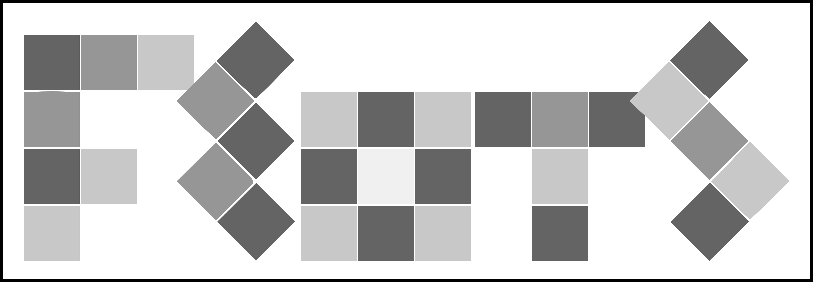
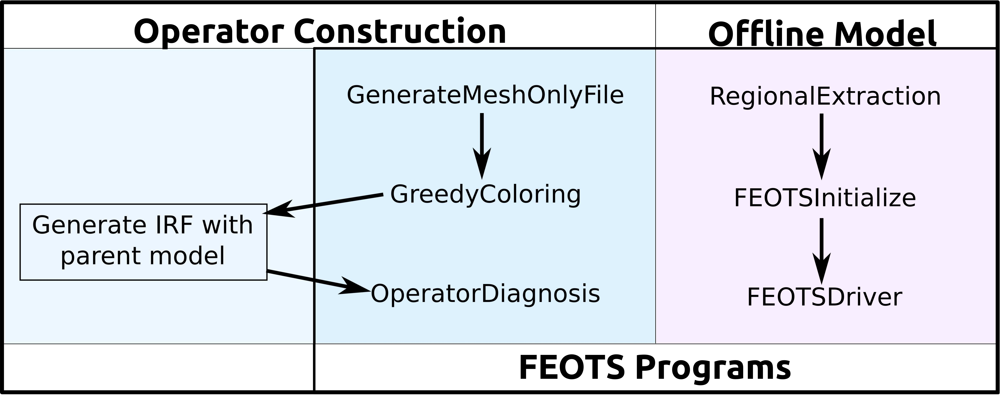

## About
 The Fast Equilibration of Ocean Tracers Software (FEOTS) is a General Circulation Model (GCM) post-processing tool for running offline passive tracer simulations. Offline passive tracer simulations are particularly attractive because they can be run on fewer computational resources than a full-fledged GCM. FEOTS operates in either forward mode or equilibration mode for performing transient simulations or for obtaining equilibrium solutions.  For large biogeochemical tracer systems, FEOTS offers a hybrid MPI-OpenMP parallelization strategy for maintaining reasonable throughput. There are also packages for tagging water masses based on ocean state variables (e.g. potential temperature, salinity, etc.) and location, for studying ocean mixing and water mass pathways.
 
   
   
The general workflow is divided into two segments : (1) Operator Construction and (2) Offline modeling.

### Operator Construction
FEOTS offers tools for diagnosing the sparse matrices associated with discrete advection and diffusion operations consistent with a parent GCM. In this first stage of the workflow, the user constructs impulse fields using FEOTS that can be used in an appropriately configured GCM to obtain impulse response functions. The impulse fields are generated using the Greedy graph coloring algorithm, which minimizes compuational and storage resources for diagnosing and saving transport operators. Together, these two fields can be used to build a database of transport operators for driving offline tracer simulations. Currently, FEOTS has the capability of working with the Parallel Ocean Program (POP), and plans are in place to interface with the MIT General Circulation Model (MITgcm)

### Offline Modeling
Once a database is constructed, the user can configure an offline simulation using the global operators, or a regional subset. FEOTS currently supports passive dye tracers, a radionuclide-particulate scavenging model, and settling particulates; it is trivial to add additional tracer models. The offline model also offers a package for tagging water masses by location and an ocean state variable, such as temperature, salinity, or potential density. FEOTS is accelerated with OpenMP and can leverage MPI for problems with a large number of tracers.
 

 

